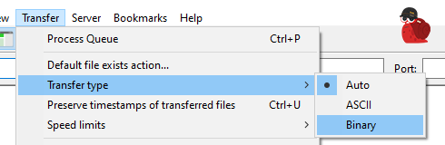

# CFX Asset Escrow

The Asset Escrow system is a ownership system created by the Cfx to protect both customers and sellers.

Your assets(scripts, maps, etc) are delivered automatically by the system and will appear in the [keymaster](https://keymaster.fivem.net/), under the [Granted Assets](https://keymaster.fivem.net/asset-grants) tab.

## Common issues

### Error: syntax error near '<&#92;&#x200b;1>'

This error indicates that your package has been corrupted or that your server artifacts are outdated.

If your server is outdated please update it to the latest recommended build, wich you can find [here](https://runtime.fivem.net/artifacts/fivem/build_server_windows/master/).

If that's not the case, then your package is corrupted. Often, this is caused by FTP softwares like **FileZilla**, while transferring the files to your server.

To fix this, you have to either use [WinSCP](https://winscp.net/eng/download.php), wich is a different FTP software, or set FileZilla to binary mode.

