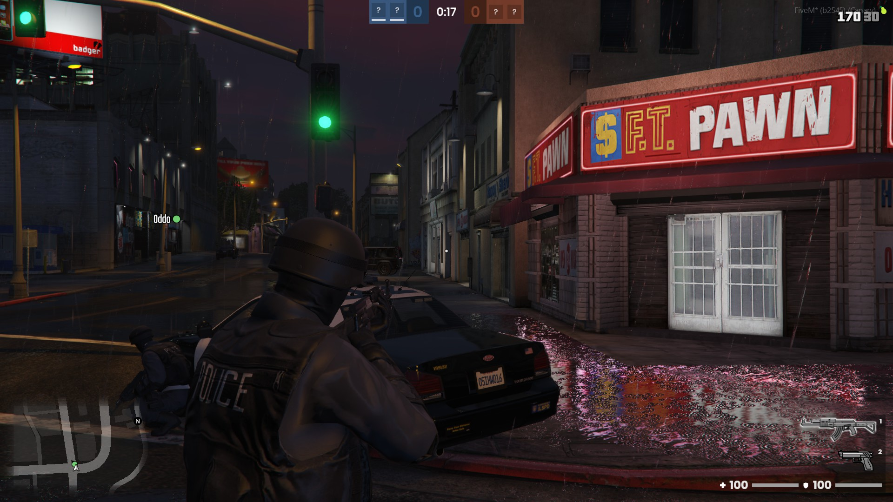

import Tabs from '@theme/Tabs';
import TabItem from '@theme/TabItem';

# fivepunch-cops-and-robbers

---

**A tactical team-based shooter for FiveM**



---

## Installation

### Download

After the purchase you will receive an email from Tebex containing the instructions to download the resource.

Alternatively, you can go to https://keymaster.fivem.net/asset-grants and download it.

### Setting up

1. Extract the `fivepunch-cops-and-robbers.pack.zip` file to a folder called `fivepunch-cops-and-robbers` inside your resources folder.

2. Add the following to your `server.cfg` to start the resource.

```cfg
ensure fivepunch-cops-and-robbers
```

---

## Configuration

All the configurations for the mini-game and the matchmaking are in the file config.lua. Tweak it to best suit your needs.

```lua
LOCALE = {
  LANGUAGE = 'en' -- Default language
}

GAME_CONFIG = {
  MAX_ROUNDS = 8, -- Maximum rounds of each match
  TIME_TO_ROUND_END_IN_MS = 1 * 60 * 1000, -- Time for the round to end giving victory to robbers

  TIME_TO_DESTROY_GAME = 30 * 1000, -- Timeout to clean up a game after it finishes

  DEFAULT_TIME_TO_HIDE_NOTIFICATIONS_IN_MS = 10 * 1000, -- Default time to hide notifications
  TIME_WAITED_TO_START_SPECTATING_IN_MS = 5 * 1000, -- Time after death to start spectating a teammate

  TEAM_COLORS = {
    COPS = "#39608b",
    ROBBERS = "#82412d"
  } -- Team related colors
}

MATCHMAKING_CONFIG = {
  TIME_TO_START_ROUND_IN_MS = 15 * 1000, -- Time to start the first round
  TIMEOUT_TO_START_MATCH_IN_MS = 15 * 1000, -- Timeout to start the first round after creating a match

  MAX_ITEMS_PER_PAGE = 20 -- Maximum items per page in lobby pagination
}

BUCKET_CONFIG = { -- Configuration related to FiveM routing bucket
  POPULATION_ENABLED = false,
  LOCKDOWN_MODE = 'strict'
}

INPUT_CONFIG = { -- Configuration related to FiveM key mapping
  SCOREBOARD = {
      KEY = "tab", -- Default key
      MAPPER = "keyboard", -- Default mapper (optional)
  },
  SELECT_LONG_WEAPON = {
      KEY = "1",
      MAPPER = "keyboard",
  },
  SELECT_SHORT_WEAPON = {
      KEY = "2",
      MAPPER = "keyboard",
  },
  SELECT_MELLE_WEAPON = {
      KEY = "3",
      MAPPER = "keyboard",
  },
  SPECTATE_NEXT_PLAYER = {
      KEY = "MOUSE_LEFT",
      MAPPER = "MOUSE_BUTTON",
  }
}
```

---

## Integrating

By design, we don't bake framework support in our scripts. All of our creations are standalone, but they can be easily integrated with the framework of your preference.

Here are some examples of how to integrate this script to some of the most common frameworks in the FiveM community.

<Tabs>

<TabItem value="standalone" label="Standalone">

This resource is standalone by default, so you can safely download it and put it on your server.

</TabItem>

<TabItem value="qb" label="QB">

This resource is standalone, but to make the better compatibility in qb-core need some changes in others resource, some like remove default HUD, inventory, health system and others stuffs when playing.

QB support is still a work in progress. You can stay tuned to Fivepunch channels to know when it's out.

</TabItem>

<TabItem value="esx" label="ESX">

This resource is standalone, but to make the better compatibility in esx need some changes in others resource like HUD, inventory, health system and others stuffs when playing.

ESX support is still a work in progress. You can stay tuned to Fivepunch channels to know when it's out.

</TabItem>

</Tabs>

---

## How to add a new Map

1. Create a JSON file inside the `data/maps` folder, for example, `data/maps/shop_02.json`.

2. Start editing your map following the [`Map structure`](#map-file-structure).

3. Include your map in the `fxmanifest.lua`, in the `include_maps` section.

```lua
include_maps {
  'shop_01',
  'shop_02' -- Registering new map
}
```

### Map file structure

```json title=shop_02.json
{
  "id": "shop_02", // contains one indentifier (needs to be the same as the file name)
  "type": "store", // contains one map type, see `How to add a new Map Type`
  "cameras": [
    {
      "name": "DEFAULT_SCRIPTED_CAMERA",
      "coords": { "x": 0.0, "y": 0.0, "z": 0.0 },
      "rotation": { "x": 0.0, "y": 0.0, "z": 0.0 },
      "fov": 65.0
    }
  ],
  "weather": {
    "schedules": [
      { "hours": 15, "minutes": 0 },
      { "hours": 21, "minutes": 0 }
    ], // possible schedules (randomized)
    "weathersType": ["RAIN", "CLEAR"] // possible weathers type
  },
  "vehicles": [
    {
      "model": "riot", // vehicle model (akuma, riot, etc)
      "type": "automobile", // vehicle type (automobile, bike, boat, etc)
      "coords": { "x": 0.0, "y": 0.0, "z": 0.0 }, // vehicle spawn coords
      "heading": 0.0 // vehicle spawn heading
    }
  ],
  "teams": [
    {
      "type": "COPS",
      "spawn": [
        {
          "coords": { "x": 0.0, "y": 0.0, "z": 0.0 }, // player spawn coords
          "heading": 0.0, // player spawn heading
          "animation": {
            "dictionary": "oddjobs@shop_robbery@rob_till",
            "name": "loop",
            "blendInSpeed": 4.0,
            "blendOutSpeed": 4.0,
            "flags": 1
          } // animation is optional
        }
      ]
    },
    {
      "type": "ROBBERS",
      "spawn": [
        {
          "coords": { "x": 0.0, "y": 0.0, "z": 0.0 }, // player spawn coords
          "heading": 0.0, // player spawn heading
          "animation": {
            "dictionary": "oddjobs@shop_robbery@rob_till",
            "name": "loop",
            "blendInSpeed": 4.0,
            "blendOutSpeed": 4.0,
            "flags": 1
          } // animation is optional
        }
      ]
    }
  ]
}
```

---

## How to add a new Map Type

Map types are used for filtering maps in the matchmaking system. Players can select an option and find a random map for their match.

1. Go to `data/maps/` and open `types.json`.

2. Add your map type configuration. Example:

```json title="types.json"
{
  "type": "jewelry", // Type used when declaring the map
  "maxPlayersPerTeam": 6 // Max players per team
}
```

---

## How to add new Weapons

You can add news weapons to the game.

1. Add weapon icon inside folder `data/weapons/icons`, example: `data/weapons/icons/weapon_dagger.png`

2. Add weapon data in `data/weapons/weapons.json`.

```json title="weapons.json"
{
  "id": "weapon_dagger", // weapon name
  "type": "MELLE_WEAPON", // weapon type (MELLE_WEAPON, SHORT_WEAPON, LONG_WEAPON, THROWABLE, MISC)
  "icon": "weapon_dagger.png" // icon filename added in `data/weapons/icons/`
}
```

---

## How to add a new Weapon Group

Weapon groups declare the weapons that can be used in the match.

1. Go to `data/weapons/groups` folder and create a new json file.

2. Add in json file your configuration, example:

```json title="pistol.json"
{
  "id": "pistol_rifle", // identifier (needs to be the same as filename)
  "weapons": [
    [
      {
        "id": "weapon_pistol", // weapon id defined in `data/weapons/weapons.json`.
        "ammo": 200 // ammo (optional)
      },
      {
        "id": "weapon_assaultrifle",
        "ammo": 200
      }
    ]
  ]
}
```

3. Add your weapon group to be included in `fxmanifest.lua` on `include_weapon_groups` section.

```lua
include_weapon_groups {
  "pistol",
  "rifle",
  "pistol_rifle" -- Registering new weapon group
}
```

---

## How to add a new Outfit

Outfits are used the define appearance of player according team type

1. Go to `data/outfits` folder and create a new json file.

2. Add in json file your configurations, example:

```json title="mp_male_cop_02.json"
{
  "type": "COPS", // team type to defined this outfit (COPS, ROBBERS)
  "model": "mp_m_freemode_01", // ped model can use this outfit (mp_m_freemode_01, mp_f_freemode_01, ...)
  "components": [
    { "drawable": 52, "component_id": 1, "texture": 0 },
    { "drawable": 17, "component_id": 3, "texture": 0 }
  ],
  "props": [
    { "prop_id": 0, "drawable": 141, "index": 0 },
    { "prop_id": 1, "drawable": 1, "index": 0 }
  ]
}
```

---

## How to add a new Locale

Localization are used to all text in this resource.

1. Go to `data/locales` folder, and create a new json, with name to locale to be added.

2. Copy all content in `data/locales/en.json` and paste it into the json file you created.

3. Start your translation.

Also you can change the current locale in `config.lua`, see [`Configuration`](#configuration)

---

## Client Events

### `copsandrobbers:matchStart`

Triggered when match started

```lua
--- @table data
--- @field mapId number
--- @field teams table
--- @field weaponGroup number
--- @field weather table

AddEventHandler("copsandrobbers:matchStarted", function(data)
  print(json.encode(data))
end)
```

### `copsandrobbers:matchFinished`

Triggered when match finished

```lua
--- @table data
--- @field winnerTeamId number

AddEventHandler("copsandrobbers:matchFinished", function(data)
  print(json.encode(data))
end)
```

### `copsandrobbers:roundStart`

Triggered when round started

```lua
--- @table data
--- @field gameId number
--- @field roundStartAt number
--- @field roundEndAt number

AddEventHandler("copsandrobbers:roundStart", function(data)
  print(json.encode(data))
end)
```

### `copsandrobbers:roundEnd`

Triggered when round end

```lua
--- @table data
--- @field winnerTeamId number
--- @field reason enum(TeamExtermination = 1, Timeout = 2)

AddEventHandler("copsandrobbers:roundEnd", function(data)
  print(json.encode(data))
end)
```

### `copsandrobbers:teamSwap`

Triggered when swap teams

```lua
AddEventHandler("copsandrobbers:teamSwap", function() end)
```

### `copsandrobbers:playerFatalDamaged`

Triggered when local player dead

```lua
AddEventHandler("copsandrobbers:playerFatalDamaged", function(culpritServerId, assistServerId, weaponHash, wasHeadshot)
  print(culpritServerId, assistServerId, weaponHash, wasHeadshot)
end)
```

### `copsandrobbers:playerRevive`

Triggered when local player revive

```lua
AddEventHandler("copsandrobbers:playerRevive", function() end)
```

### `copsandrobbers:startSpectating`

Triggered when start spectating

```lua
AddEventHandler("copsandrobbers:startSpectating", function() end)
```

### `copsandrobbers:stopSpectating`

Triggered when stop spectating

```lua
AddEventHandler("copsandrobbers:stopSpectating", function() end)
```

---

## Server exports

### `getPlayerNameCallback`

```lua
---@param fn A function that is executed when get player name
exports['fivepunch-cops-and-robbers']:getPlayerNameCallback(function(playerServerId)
  -- TODO
end)
```

---

## Server events

### `copsandrobbers:createdMatch`

Triggered when one match is created

```lua
AddEventHandler("copsandrobbers:createdMatch", function(game)
  print(json.encode(game))
end)
```

### `copsandrobbers:matchFinished`

Triggered when one match finish

```lua
AddEventHandler("copsandrobbers:matchFinished", function(game)
  print(json.encode(game))
end)
```

### `copsandrobbers:roundStart`

Triggered when round start

```lua
--- @table data
--- @field gameId number
--- @field roundStartAt number
--- @field roundEndAt number

AddEventHandler("copsandrobbers:roundStart", function(data)
  print(json.encode(data))
end)
```

### `copsandrobbers:roundEnd`

Triggered when round end

```lua
--- @table data
--- @field gameId number
--- @field winnerTeamId number
--- @field reason enum(TeamExtermination = 1, Timeout = 2)

AddEventHandler("copsandrobbers:roundEnd", function(data)
  print(json.encode(data))
end)
```

---

## Common errors

### Error parsing script / Failed to load script

Your server artifacts are likely outdated. Update your server to version 5181 or above.

### You lack the required entitlement to use fivepunch-cops-and-robbers

Try restarting your server and make sure your server license key is correct. If you bought the resource on the wrong account, you can transfer it to another account on keymaster.

### Failed to verify protected resource

Files were possibly corrupted during transfer. Ensure hidden files are copied; the .fxap file in a protected resource must be included. Some FTP programs skip these files.
